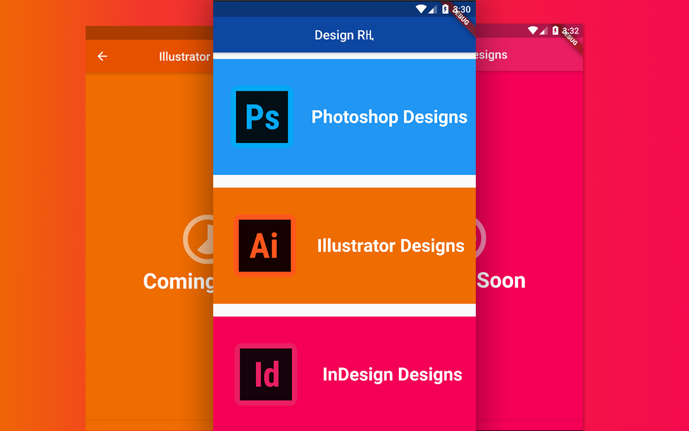

# Design Rዚ - Flutter Mobile app

A Flutter mobile app for the Graphics Design Course I took at Berehana Selam,4 Kilo,Addis Ababa,Ethiopia



## Getting Started

To get started with the project clone the repo and start debugging

```shell
git clone https://github.com/rabira-hierpa/design_rz
cd design_rz
flutter run
```

For help getting started with Flutter, view the
[online documentation](https://flutter.dev/docs), which offers tutorials,
samples, guidance on mobile development, and a full API reference.
